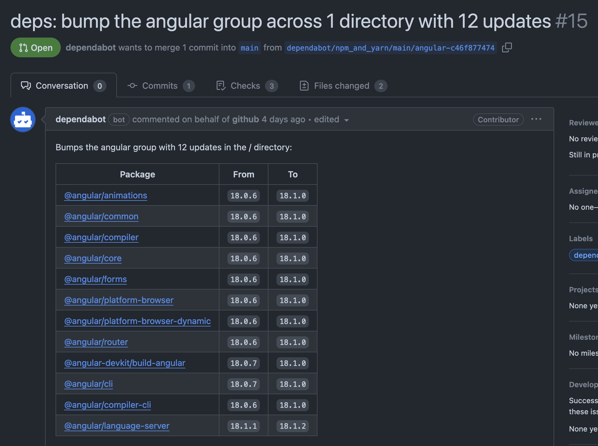

+++
title = 'Dependabot Grouping'
date = 2024-07-16T14:20:51+02:00
draft = true

tags = ['Angular', 'NodeJS', 'Typescript', 'NPM', 'Dependabot']
+++

For dependencies like Angular, it can be beneficial to group Dependabot pull requests. Updating Angular dependencies individually can break the build. In this post I will explain how to group dependencies:

```yaml
version: 2
updates:
  - package-ecosystem: "github-actions"
    schedule:
      interval: "weekly"
    directory: "/"
    commit-message:
      prefix: "deps"
    open-pull-requests-limit: 10
  - package-ecosystem: "npm"
    directory: "/"
    schedule:
      interval: "daily"
    commit-message:
      prefix: "deps"
    open-pull-requests-limit: 10
    target-branch: "main"
    rebase-strategy: "auto"
    groups:
      angular:
        applies-to: version-updates
        patterns:
          - "@angular*"
        update-types:
          - "minor"
          - "patch"
```

In the above example, Dependabot is configured to create an Angular group to match all dependencies that start with @angular by applying the @angular\* pattern. Angular dependencies will be grouped only when minor or patch versions change. For a new major Angular version, Dependabot will create a separate pull request. Example grouped pull request.


