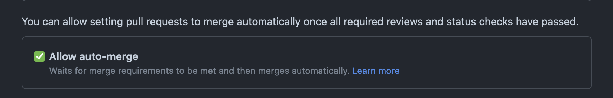

+++
title = 'Github Actions Dependabot and Automerging'
date = 2024-07-16T13:46:25+02:00
draft = true

tags = ['Github', 'Github Actions', 'Dependabot', 'Automerging', 'Hugo', 'Rust', 'Angular']
+++

In this post I will explain how to configure a simple Github Actions workflow with Dependabot and Github Automerging.

Automerging can be useful to allow automatic merging of pull requests after rules are fulfilled, for example # of approvals and build status checks.

Also for dependabot pull requests it can be useful to automatically merge dependency patch updates in your project.

## Step 1

Make sure to enable Github Automerging in your project repository settings.



## Step 2

Add a dependabot.yml file to the repository at `/.github/dependabot.yml` with the following contents:

```yaml
version: 2
updates:
  - package-ecosystem: "github-actions"
    schedule:
      interval: "weekly"
    directory: "/"
  - package-ecosystem: "gitsubmodule"
    directory: "/"
    schedule:
      interval: "daily"
```

This is the example I use for this website. I also have examples for [Ansible](https://github.com/roadmanict/angular-notes/blob/main/.github/dependabot.yml) and [Rust](https://github.com/roadmanict/rs-ynab-importer/blob/main/.github/dependabot.yml).

## Step 3

Add a Github Actions Workflow file:

```yaml
name: Hugo build

on:
  push:
    branches:
      - main
  pull_request:
    branches:
      - main

permissions:
  contents: write
  pull-requests: write

jobs:
  build:
    runs-on: ubuntu-latest

    steps:
      - name: Checkout code
        uses: actions/checkout@v3
        with:
          submodules: true

      - name: Set up Hugo
        uses: peaceiris/actions-hugo@v2
        with:
          hugo-version: "latest"
          extended: true

      - name: Build the site
        run: hugo --minify

  automerge-pr:
    runs-on: ubuntu-latest
    needs: [build]

    if: github.actor != 'dependabot[bot]' && github.ref != 'refs/heads/main'

    steps:
      - name: Enable auto-merge for PRs
        run: gh pr merge --auto --rebase "$PR_URL"
        env:
          PR_URL: ${{github.event.pull_request.html_url}}
          GH_TOKEN: ${{secrets.GITHUB_TOKEN}}

  dependabot-automerge:
    runs-on: ubuntu-latest
    needs: [build]

    if: github.actor == 'dependabot[bot]' && github.ref != 'refs/heads/main'

    steps:
      - name: Dependabot metadata
        id: metadata
        uses: dependabot/fetch-metadata@v2
        with:
          github-token: "${{ secrets.GITHUB_TOKEN }}"
      - name: Enable auto-merge for Dependabot PRs
        run: gh pr merge --auto --rebase "$PR_URL"
        env:
          PR_URL: ${{github.event.pull_request.html_url}}
          GH_TOKEN: ${{secrets.GITHUB_TOKEN}}
```

The important parts from this example are:

### Permissions

```yaml
permissions:
  contents: write
  pull-requests: write
```

This will give the workflow permission to enable the automatic merge of the PR.

### Automerge

The jobs called `automerge-pr` and `dependabot-automerge` are configured to enable automerge when the build is successful by using the `needs` property.

```yaml
needs: [build]
```

It's possible to configure Dependabot automerge to only trigger on semver patch updates like this.

```yaml
- name: Dependabot metadata
  id: metadata
  uses: dependabot/fetch-metadata@v2
  with:
    github-token: "${{ secrets.GITHUB_TOKEN }}"
- name: Enable auto-merge for Dependabot PRs
  if: steps.metadata.outputs.update-type == 'version-update:semver-patch'
```

Example from [this repository](https://github.com/roadmanict/rs-ynab-importer/blob/main/.github/workflows/rust.yml)
